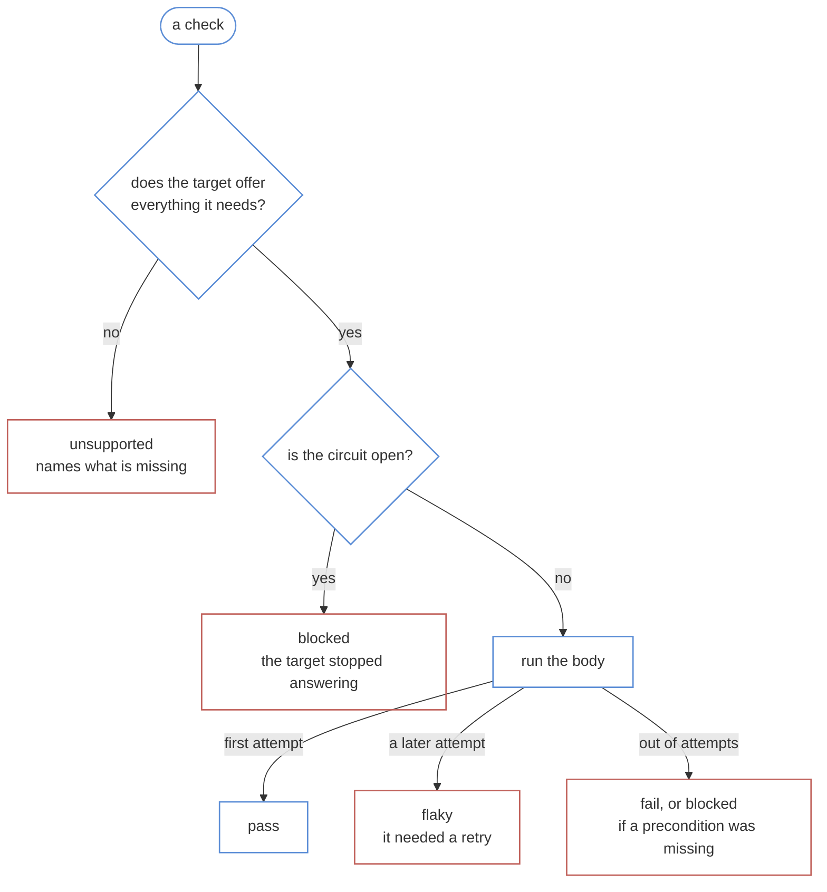
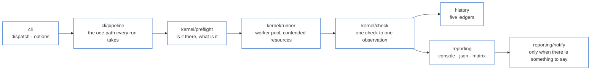

# Architecture

One rule, six directories, and a public surface of exactly one file.

> [!NOTE]
> The layering here isn't a naming convention you have to remember. `src/index.ts` is what a harness can reach; anything not exported there is the kernel's own business, and a harness that tries to import it gets a module that doesn't resolve.

## Contents

- [The one rule](#the-one-rule)
- [What happens to one check](#what-happens-to-one-check)
- [The run, end to end](#the-run-end-to-end)
- [The directories](#the-directories)
- [Five things that are deliberate](#five-things-that-are-deliberate)
- [How a change gets made](#how-a-change-gets-made)

## The one rule

**Nothing in here may know what any particular target is.**

The test is whether a thing would still make sense for a target that doesn't exist yet — a CLI, a queue consumer, a mobile app. Percentiles belong. Add-to-cart doesn't.

| Belongs here                                            | Belongs in a harness                    |
| ------------------------------------------------------- | --------------------------------------- |
| A run, its id, its seed, the build stamped at preflight | What your target is and how to reach it |
| The eight verdicts, and which two are red               | Which checks are worth running          |
| Retrying, and what a retry means about a check          | What counts as a failure of your thing  |
| Giving up on a target that's stopped answering          | How to find something on a page         |
| The five ledgers                                        | What a change to a file puts at risk    |
| Reporting, the sign-off sheet, telling somebody         | The sign-off rows themselves            |

Because the kernel can't name a target, a change to how runs work can't quietly become a change to what your software is. And because a harness can only reach the public surface, a fix in your target can't quietly change what `flaky` means.

## What happens to one check

`kernel/check.ts` is the middle of the whole system. It asks three questions in a fixed order, and the order is the design.



Three things fall out of that shape.

**A capability is checked before anything runs**, so a check that can't mean anything here costs nothing and reports `unsupported` naming what was missing.

**A check that only passed on a later attempt reports `flaky`.** That's the one thing the run learned about the suite, and calling it green throws it away. If it's quarantined, it reports `quarantined` instead — somebody wrote down why, and showing `flaky` every run afterwards reads as though nobody had.

**Evidence is kept only where the verdict needs explaining.** A passing check discards its own artefacts. A run that leaves a trace behind every time is a disk filling up for nothing.

## The run, end to end



`cli/pipeline.ts` is the one path every run takes. It preflights first and on its own, and **a preflight that comes back `blocked` means no checks run at all** — a run that can't say what it tested isn't evidence about anything.

## The directories

| Where            | What it owns                                                                                                                                                          |
| ---------------- | --------------------------------------------------------------------------------------------------------------------------------------------------------------------- |
| `src/index.ts`   | The public surface. If it isn't exported here, a harness can't have it                                                                                                |
| `src/cli/`       | `dispatch`, `options`, `pipeline`, `harness`, and one file per command                                                                                                |
| `src/kernel/`    | `check`, `runner`, `verdict`, `circuit`, `retry`, `failure`, `preflight`, `observation`, `seed`, `selection`, `areas`, `artefacts`, `journal`, `lock`, `probe`, `run` |
| `src/history/`   | `signature`, `measurements`, `drift`, `flake`, `quarantine`, `notified`, `schedule` — the five ledgers, plus what the channel has been told                           |
| `src/reporting/` | `console-reporter`, `json-reporter`, `matrix-reporter`, `notify`, `summary`, `percentile`                                                                             |
| `src/surfaces/`  | `http`, `smtp`, `webhook` — the ways it can reach the outside                                                                                                         |
| `src/targets/`   | `target` and `registry`: the contract a harness implements                                                                                                            |
| `src/schedule/`  | `systemd` — the units `schedule install` writes                                                                                                                       |
| `src/paths.ts`   | `workspaceAt`, and the only place the four directories are named                                                                                                      |
| `fixtures/`      | The stub target. Every check in the suite runs against this, never a live target                                                                                      |

## Five things that are deliberate

**Nothing is reached for; everything is handed over.** The harness carries its own name, registry and workspace, and the kernel takes them as arguments. Two harnesses can't share a ledger by accident because neither one can find the other's.

**A dead target costs one fact.** Three transport failures with nothing reaching the target in between and the circuit opens. "Consecutive" means _with nothing getting through in between_, which is what keeps it meaningful once checks interleave under a wide pool.

**Only transport and timeout failures are ever retried.** Retrying an assertion hides the defect it found. A timeout gets two attempts rather than three, because hammering a slow target kills it.

**A wide run neither judges nor records timings.** A number taken alongside three other checks isn't comparable with one taken alone, so it declines to pretend rather than recording a slower number as a regression.

**Every check's randomness comes from the run seed and its own id**, so it doesn't depend on the order things ran in. A four-worker run and a one-worker run make the same choices, and `--seed` replays either.

## How a change gets made

**Start at the stub, not the change.** `fixtures/` is a target the suite serves itself, and it can be told to carry a specific defect. Add the broken behaviour first, prove your change catches it, then prove the healthy stub stays quiet. **One direction isn't a test**: a check that fires isn't evidence it can be quiet, and a check that's quiet isn't evidence it can fire.

```bash
make check
```

The build, eslint, prettier and the unit suite — 199 tests. That's what a commit has to pass, and the pre-commit hook runs it whether you remember or not.

```bash
make selfcheck-loud
```

The other direction, end to end. It proves the alarm actually fires: that a wide run contributes no measurement, that a half-described channel is refused before the suite runs, that a channel refusing the message exits 3, that a second run against a busy target names the holder and does nothing, and that a lock whose process is gone is taken over rather than obeyed forever. **A green suite proves none of those.**

### Three questions before writing anything

1. **Would this sentence still be true of a target that doesn't exist yet?** If not, it belongs in a harness, not in here.
2. **What does this do when the target can't offer what it needs?** Not fail. Report `unsupported` and name what was missing.
3. **What does this print when nothing is wrong?** If the answer isn't "nothing", it will be ignored within a week, and then it can't tell anybody anything.
